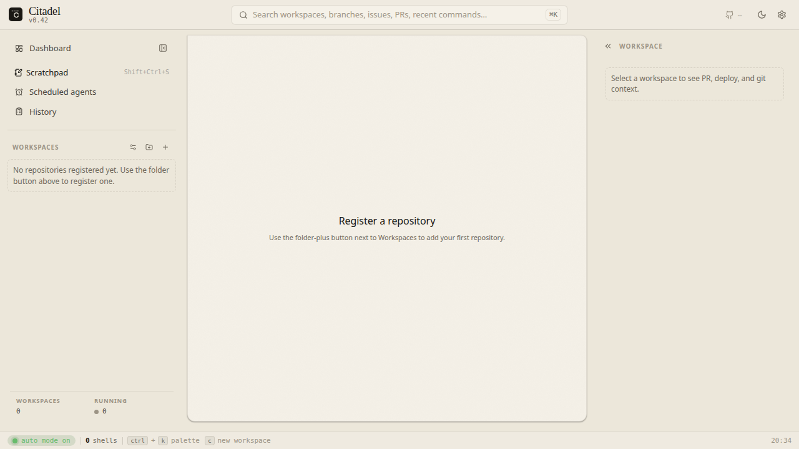
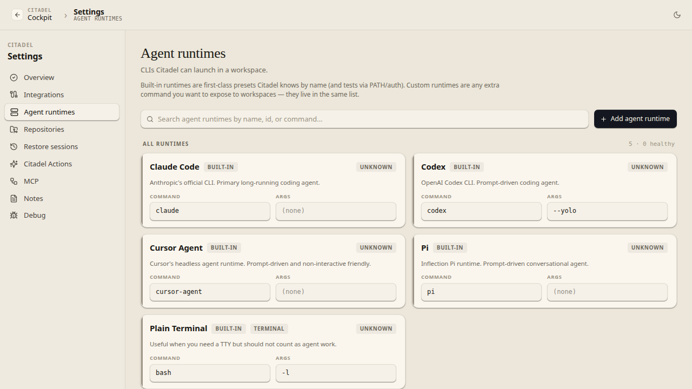
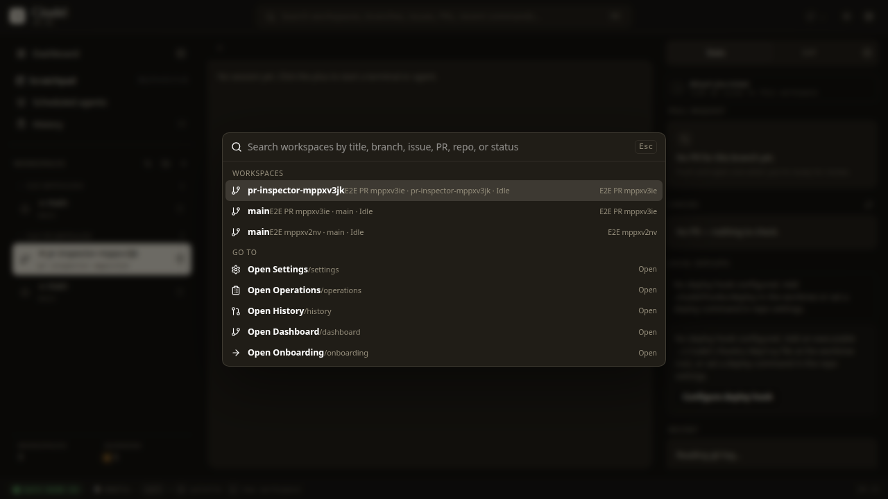
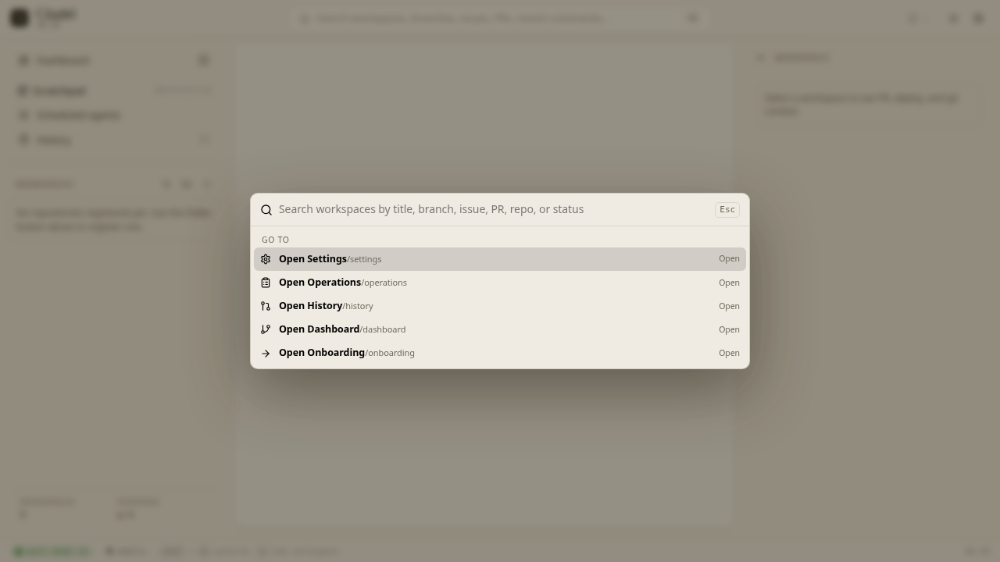

# Citadel

[](https://github.com/ovdmar/citadel/actions/workflows/ci.yml)

Citadel is a local-first cockpit for managing AI coding agents across git workspaces, durable terminals, pull requests, checks, issue trackers, hooks, and local preview surfaces.

It is built for the workflow where several long-running agents are working in different local worktrees and the operator needs one place to answer: what is running, what changed, what is blocked, what is ready for review, and what should happen next?



## What It Does

- Registers local repositories and creates isolated git workspaces.
- Starts durable shell-backed agent sessions inside those workspaces.
- Keeps terminal sessions alive across browser refreshes and daemon restarts.
- Shows workspace state, branch state, PR/check status, issue links, local apps, operations, and activity in one cockpit.
- Exposes a local daemon API over REST, SSE, terminal WebSocket, and MCP tools.
- Runs locally by default with SQLite persistence and loopback-only networking.

Citadel is not a hosted SaaS product. It is a developer-machine control plane for local agent work.

## Status

Citadel is an active source-available project. The core local workflow is implemented and tested, but the product is still evolving.

Stable today:

- local daemon + React cockpit
- repository/workspace lifecycle
- SQLite persistence and forward migrations
- tmux-backed agent and terminal sessions
- PR/check/provider summaries through local provider adapters
- local install, upgrade, doctor, smoke, and e2e verification paths
- architecture boundary checks and package-level TypeScript project references

In progress:

- broader design-system migration across older cockpit surfaces
- PTY-daemon terminal performance work
- richer human-review and provider workflows
- expanded first-run and configuration UX

## Screenshots

| Cockpit | Settings |
|---|---|
|  |  |

| Dark theme | Light theme |
|---|---|
|  |  |

## Architecture

Citadel is a TypeScript monorepo with a local daemon, browser cockpit, and small domain packages.

| Area | Purpose |
|---|---|
| `apps/web` | React, Vite, TanStack Router/Query cockpit UI |
| `apps/daemon` | local REST/SSE/WebSocket daemon and operation runner |
| `apps/cli` | thin local helper surface |
| `packages/contracts` | Zod API/event DTOs shared by daemon and web |
| `packages/core` | pure domain logic and state helpers |
| `packages/db` | SQLite schema, migrations, and persistence helpers |
| `packages/operations` | side-effectful workspace, session, and lifecycle workflows |
| `packages/terminal` | tmux/PTY terminal adapters and WebSocket protocol |
| `packages/providers` | version-control, PR, CI, issue, and usage provider adapters |
| `packages/runtimes` | agent runtime contracts and launch profiles |
| `packages/hooks` | repo hook discovery, execution, and output contracts |
| `packages/mcp` | normalized local MCP tools/resources |
| `packages/testing` | deterministic test fixtures and fake providers |

The codebase enforces boundaries with static checks:

- `packages/core` stays pure and does not import implementation packages.
- `apps/web` talks to the daemon through shared contracts, not daemon internals.
- workspace cleanup paths must preserve dirty work unless an explicit force policy is used.
- dependency changes are checked by a local dependency-policy gate.

See [Citadel v2 Architecture](docs/architecture/citadel-v2-architecture.md) and [Technical Decisions](docs/architecture/technical-decisions.md).

## Technical Choices

Citadel deliberately chooses a local-first architecture:

- **Local daemon + browser UI, not hosted SaaS:** agent work, repositories, terminals, and provider CLIs already live on the developer machine.
- **SQLite, not a remote database:** state is local, inspectable, easy to back up, and enough for one operator's workbench.
- **Zod contracts between packages:** the daemon and browser share typed request/response/event contracts without importing each other's internals.
- **tmux and PTY-backed terminals:** sessions survive browser refreshes and daemon restarts while preserving real terminal behavior.
- **Provider adapters, not provider-specific UI:** GitHub/Jira-style integrations are implementations behind normalized PR, check, issue, and provider-health surfaces.
- **Checks as product infrastructure:** architecture boundaries, size limits, typecheck, lint, coverage, dependency policy, build, smoke, and Playwright e2e are part of the normal gate.

## Quickstart

Development loop:

```bash
make setup
make deploy
```

`make deploy` starts a detached worktree-scoped HMR stack: daemon under `tsx watch` plus Vite. It prints the cockpit URL.

Default long-term install:

```bash
make install
make doctor
```

Useful commands:

```bash
make check       # architecture, size, typecheck, lint, coverage, deps, build
make smoke       # local daemon smoke checks
make e2e         # Playwright suite
make doctor      # installed-system verification
```

Runtime defaults:

- long-term daemon: `http://127.0.0.1:4010`
- worktree daemon ports: `4110-4209`
- worktree Vite ports: `5210-5309`
- config: `~/.local/share/citadel/citadel.config.json`
- SQLite DB: `~/.local/share/citadel/citadel.sqlite`

See [Install](docs/operations/install.md), [Runbook](docs/operations/runbook.md), and [Worktree Development](docs/operations/worktree-development.md).

## Quality Bar

The main local gate is:

```bash
make check
```

It runs:

- architecture boundary checks
- file-size checks
- TypeScript project-reference typecheck
- Biome lint/format check
- Vitest coverage
- dependency policy
- production build

UI and integration confidence comes from Playwright:

```bash
make e2e
pnpm e2e:isolated
```

The isolated wrappers allocate temporary state so tests do not write into the operator's real Citadel database or config.

## For Reviewers

If you are evaluating the repository, start here:

1. Read this README for the product and architecture overview.
2. Skim [User Journeys](docs/architecture/user-journeys.md) for the intended operator workflow.
3. Read [Citadel v2 Architecture](docs/architecture/citadel-v2-architecture.md) for package boundaries.
4. Open `apps/web/src/main.tsx` and `apps/daemon/src/app.ts` to see the browser/daemon entry points.
5. Review `packages/contracts/src/index.ts` for the API/event model.
6. Run `make check` to exercise the normal quality gate.
7. Browse `e2e/` for the user-facing regression coverage.

The repo also contains agent/process artifacts used to build the project. They are documented separately in [Docs Map](docs/README.md) so they do not need to be read as product documentation.

## Documentation

- [Docs Map](docs/README.md)
- [Product Specs](specs/README.md)
- [Architecture](docs/architecture/citadel-v2-architecture.md)
- [Technical Decisions](docs/architecture/technical-decisions.md)
- [User Journeys](docs/architecture/user-journeys.md)
- [Install](docs/operations/install.md)
- [Runbook](docs/operations/runbook.md)
- [Config Reference](docs/operations/config-reference.md)
- [Engineering Standards](docs/contributors/v2-engineering-standards.md)
- [Contributing](CONTRIBUTING.md)

## License

Citadel is source-available under the [PolyForm Perimeter License 1.0.1](LICENSE). Commercial use is allowed when it does not provide a product or service that competes with Citadel. Redistributions must preserve the required notice pointing to the original repository.
